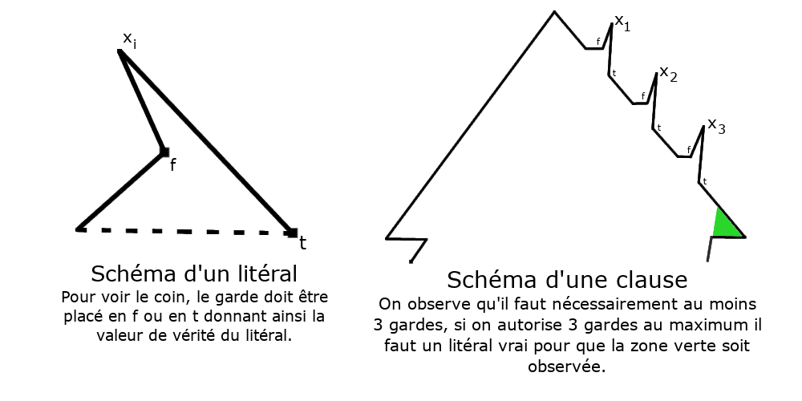
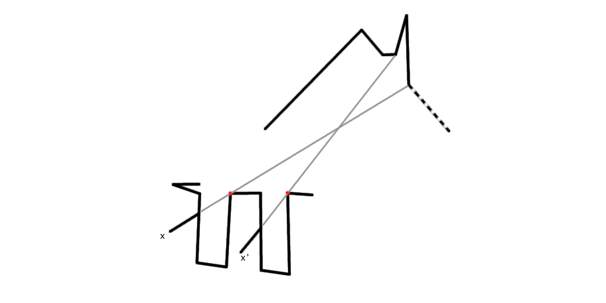

# TIPE : Comment garder un musée

# I - Structure du problème

## Présentation du problème global, lien avec le thème

On s'interesse dans ce projet au problème soulevé par V.Klee en 1973. On suppose un musée et on se demande combien de gardes immobiles sont nécessaires afin de le surveiller. On prendra ainsi des polygones simples, donc la forme peut être quelconque.

La sécurité est une contrainte majeure dans les grandes villes de nos jours, un algorithme pouvant résoudre notre problème permettrait alors d'optimiser le placement de caméras de sécurité. Cela permettrait de limiter les coûts et infrastructures tout en assurant une surveillance permanente de tous les quartiers.

## Approche théorique (complexité)

1. On commence par montrer que le problème est dans NP

    - On commence par remarquer qu'une solution est un ensemble de sommets du polygone et est donc bien de taille polynomiale. Montrons maintenant que la vérification se fait en temps polynomial.

    - Le calcul de la zone visible par un garde donné se fait en temps polinômial et forme des polygones, on peut ensuite construire l'union toujours en temps polynomial puis vérifier l'égalité entre le polygone obtenu et celui de départ. On a ainsi bien que le problème est dans NP.

2. Montrons ensuite que le problème est NP-Complet

    - On va ici montrer que le problème 3-SAT se réduit à notre problème. Pour cela on commence par considérer une clause de 3-SAT de la forme $(x_1\lor x_2\lor x_3)$ avec les $x_i$ des litéraux.

    

    - En limitant le nombre de gardes maximum on a bien que chaque clause doit être vraie pour que le schéma de clause soit couvert par les gardes. On peut ainsi placer les  clauses côte à côte en autorisant 3 gardes par clause, si le placement des gardes en retour contient assez peu de gardes alors la formule est vérifiable. Reste à s'assurer qu'une même variable a bien la même valuation dans chaque clause. On construit alors la structure ci-dessous pour chaque variable

    

    - En alignant correctement les clauses et en ajoutant des creux comme $x$ et $x'$ pour chaque occurence de la variable. On a alors un polygone tel que si toutes les occurences de la variable ont la même valeur alors tous les creux d'une colonnes sont observés et tous ceux de l'autre non, on place donc un garde sur l'un des points rouges.

    - En limitant le nombre de gardes au triple du nombre de clause plus le nombre de variables distinctes on a bien que le polygone est recouvert si et seulement si la formule est satisifable. On a finalement que le problème est dans NP car il se réduit en temps polynomial à 3-SAT.

## Sur la génération de polygones

La galerie d'art étant représentée par un polygone, il est bon de s'intéresser à leur génération. Plusieurs formes de génération
existent. On peut en faire d'autant de façons que l'esprit humain, c'est en trouver. Cette question étant largement trop vaste
pour être intérrogée, on va partir d'une idée de base et la développer :

- L'arborescence à partir d'une structure de base

> - Partir d'un polygone choisi arbitrairement à k côtés.
> - Sur chaque côté choisir aléatoirement si elle doit être "développée"
> - S'il y a developpement : créer un nouveau polygone avec un côté commun au précédent
> - Répéter sur l'entiereté de la structure un nombre aléatoire de fois

_Le problème est que pour une structure de base choisit les figures seront relativement similaire.
On étudierait alors le problème de la galerie d'art sur un ensemble de figures qui se ressemblent._

- Création directe d'un polygone

> - On choisit sur le plan n points
> - On crée son enveloppe convexe par l'algorithme de Graham

On a alors deux ensembles de points, celui de l'enveloppe convexe et les points intérieurs.

> - Pour chaque point intérieur, on brise l'enveloppe convexe pour créer deux nouveaux segments dans la figure finale
> - Répéter sans créer de segments qui intersectent la figure

_Il est difficile de savoir à l'avance le nombre de points de la figure convexe et donc de celle finale._

Cependant, on peut étudier une propriété qu'ont tous les polygones. C'est le fait d'être triangulisable.
Ainsi en partant d'une structure de base qui est un triangle (donc trois points pris aléatoirement sur le plan) et
en utilisant la technique de l'arborescence, on pourrait avoir un bon ensemble de polygone.

Voyons désormais les couts techniques de tels algorithmes.

L'arboresence demande une chose :

   - vérifier à chaque étape que l'ajout d'un point ne brise pas un polygone (côté qui s'intersecte) en O((i)²) où i est l'étape

Ainsi la création est en O(n²) où n est le nombre de sommets de la figure finale.

La création directe avec l'algorithme de Graham demande :

   - trier une liste de points en fonction d'un angle donc en O (n*ln(n))

Ainsi la création est en O (n*ln(n)) où n est le nombre de points choisis au départ (et non le nombre de sommets du polygone final).

On peut alors faire un mélange des deux méthodes, et pour des figures de tailles petites, on peut utiliser l'arborescence
et ont pour des figures de plus grandes tailles utiliser la création directe.

# II - Recherche de solutions algorithmiques

## Sur les polygones

Comme nous l'avons vu, la génération des polygones force un cadre de résolution, chaque polygone généré de la même façon
se ressemblant.

Ainsi si on trouve un algorithme performant, c'est-à-dire non pas à la compléxité la plus faible, mais au temps
de calcul sur un ordinateur le plus faible, alors on pourra conclure sur l'algorithme d'une part et sur l'ensemble
de polygones d'autre part.

On va donc dans un premier temps se fixer dans un cadre avec un ensemble prédéfini de polygones.

## Sur les implémentations d'algorithmes

Ce problème étant NP-complet, ses solutions seraient tous de complexité exponentielle ou plus, alors
pour pouvoir les tester, on sera obligé de prendre des polygones avec un nombre faible de côtés.

Dans ce cas-là, l'étude asymptotique ne serait qu'un faible indicateur de performance étant donné que la
constante devant rentrera largement en jeu.

On va se munir de différents témoins quant à l'efficacité de nos algorithmes.

D'une part l'implémentation la plus naïve possible, c'est-à-dire celle qui consiste à prendre un sous-ensemble
de k points aléatoirement.

L'autre algorithme, aussi naïve, est celui qui parcourt linéairement tous les cas possibles de k points.

## De meilleures implémentations

> - recherche d'algos avec des outils au programme (backtracking par exemple)

# III - Optimisation et observations

## Recherche d'algorithmes optimaux
- Krohn & Nilsson
    - Utilisation de la logique diviser pour régner
    - Le polygone se découpe récursivement jusqu'à être convexe et donc simple à traiter. Bien que non optimal cet algorithme est dans le cas général bien meilleur que la brute-force
- Bhattacharya, Ghosh & Roy
    - On considère un point du plan comme référence et on les trie selon l'angle formé avec l'origine et le point de référence. On place un garde sur le premier point puis on parcours ensuite les sommets dans l'ordre
    - Si l'angle entre le sommet, le précédent et le point de référence est de plus de 180° on place un garde et le sommet actuel devient le point de référence.
    - Sinon le sommet précédent devient le point de référence
    - En plaçant un garde sur chaque sommet où l'angle est inférieur à 180 degrés, on peut garantir que tous les points du polygone seront surveillés.
- Couto, de Rezende & de Souza
    - On trie les sommets comme au dessus et les parcours de la même façon
    - On cherche le prochain sommet non surveillé (en traçant des droites avec les gardes et regardant les intersections) et on place un garde au sommet précédent ce dernier.

## Implémentation et recherche duquel est le meilleur sur notre sample de polygones

(en cours)

